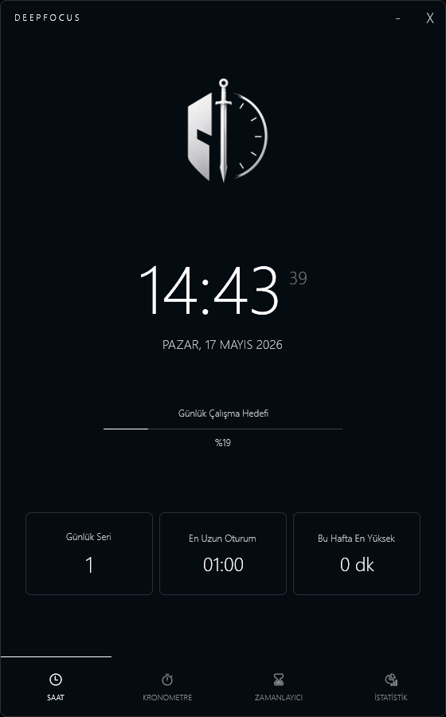
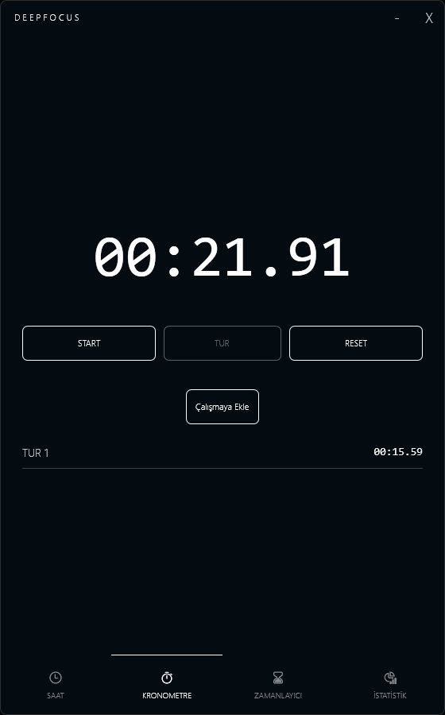
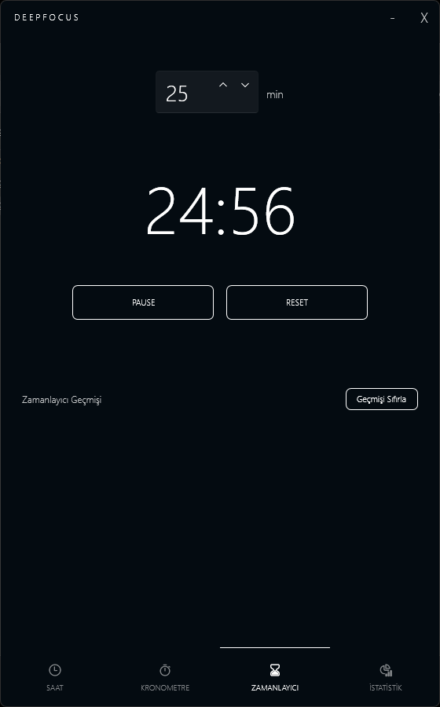
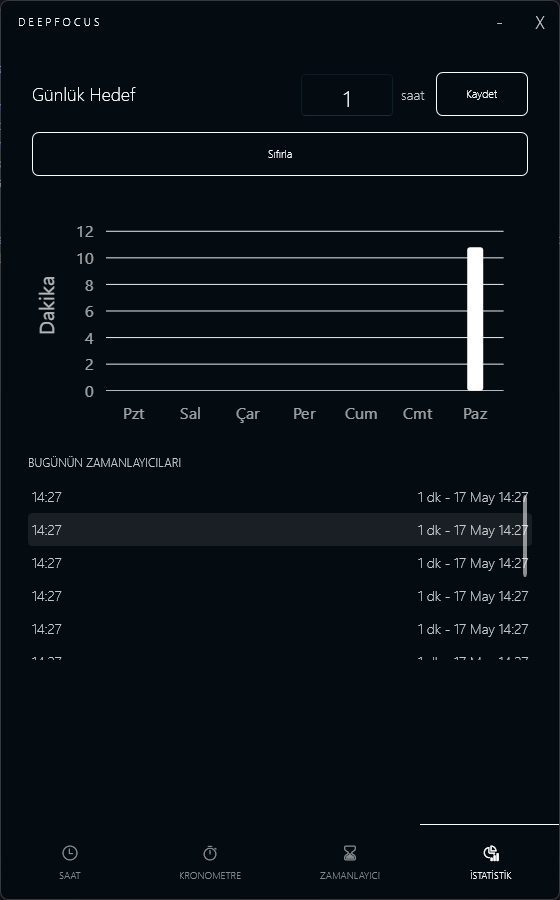

# DeepFocus 
> *Zamanını, verdiğin her nefes kadar verimli kullan.*

Aslında sosyal medyada sürekli gördüğümüz AI ile şunu bunu yaptım içeriklerinden birazda sıkılarak ama içimdeki meraktan dolayı' da denemek istediğim **vibe coding** konseptine ben'de katılmak istedim. Ve evet bir masaüstü verimlilik uygulaması olan DeepFocus ortaya çıkardım. DeepFocus aslında; hayatında sorumlulukları, yapmak istediği çalışmaları, okumaları ve tamamlamak istediği alışkanlıklarını gerçekleştirmek isterken hayattaki en büyük değer olan **zamanı** verimli kullanmak isteyen ve simgesini' de yıkılmaz inancı olan **crusader** temasından alan bireyler için tasarlamak istediğim bir verimlilik uygulaması oldu.  

Aklımda canlandırdığım ve promptlarla bir değer ortaya koyduğum uygulamamı bir masaüstü.exe haline getiresiye kadar; gerçekci prompt girmeyi, oluşabilecek hatalara karşı önlem almayı, hatalara karşı bir çözüm üretmeyi ,tasarım yapmayı ve AI ajanları arasıdna yönlendirme yapmayı deneyimledim.

---
## 📸 Ekran Görüntüleri

  
  

  
  

---

## Özellikler
### 🕐 Saat Ekranı (Dashboard)
- Gerçek zamanlı dijital saat ve günlük 
- Günlük çalışma hedefi ve ilerleme barı
- Günlük seri takibi
- En uzun oturum kaydı
- Bu hafta en yüksek çalışma süresi

### ⏱️ Kronometre
- Start / Stop / Reset
- Tur (Lap) kayıt sistemi
- Kronometre süresini çalışma saatine ekleme

### ⏳ Zamanlayıcı
- Özelleştirilebilir geri sayım (dakika bazlı)
- Süre dolunca minik bir zil sesi ve bildirim
- Zamanlayıcı geçmişi

### 📊 İstatistik
- Haftalık çalışma grafiği (Pzt - Paz)
- Günlük hedef belirleme ve sıfırlama
- Bugünün zamanlayıcı oturumları

---
## 🤖 Vibe Coding Deneyimi
Bu süreçte kullandığım araçlar:
- **OpenAI Codex** — Projenin ana iskeletini ve özelliklerini burada kurdum.
- **Google Antigravity** — Tasarımsal iyileştirmeleri ve küçük hataları burada düzelttim.
- **Blend for Visual Studio** — Görsel rütuşları burada yaptım .
- **Claude (Anthropic)** — Canlandırmak istediğim promptun stratejisini, iskeletini burada yaptım.

---

### Ne Öğrendim?

- AI'a "her şeyi yap, hatasız olsuz" mantığından çıkıp, belirli bir stratejiyle oluşturulmuş ve net
olan promptlar ile çok daha iyi bir sonuç alınabileceğini.
- AI araçları kullanılsa dahi üretilen çıktı'da olacak vizyonunun kişinin belirlediğini.
- Bir uygulamanın ekranı, mantığı ve verisi birbirinden ayrı tutulursa ne kadar düzenli olduğunu gördüm.

---

## 🛠️ Kullanılan Teknolojiler

- **WPF (.NET 8):** Kullanıcı arayüzünün oluşturulması için
- **MVVM Mimarisi:** İş mantığı ve arayüzün birbirinden ayrılması için
- **Dependency Injection:** Bağımlılıkların temiz ve yönetilebilir şekilde yönetilmesi için
- **SQLite:** Oturum geçmişi ve günlük hedef verilerinin kalıcı olarak saklanması için
- **WPF-UI (Fluent):** Modern ve şık arayüz bileşenleri için
- **LiveCharts2:** Haftalık çalışma istatistiklerinin görselleştirilmesi için
- **Interface Tabanlı Servisler:** Modüler ve test edilebilir servis yapısı için
- **OpenAI Codex & Google Antigravity:** Vibe coding yöntemiyle geliştirme süreci için

---

## 🏗️ Mimari

DeepFocus, sürdürülebilirlik sağlamak amacıyla **MVVM (Model-View-ViewModel)** mimarisi üzerine inşa edilmiştir. Bağımlılık yönetimi için Dependency Injection kullanılmış, her servis interface üzerinden inject edilerek katmanlar birbirinden bağımsız tutulmuştur.

---
## 🚀 Kurulum
1. Sağ üstteki **Releases** sekmesine tıkla
2. En son sürümden `DeepFocus.exe` dosyasını indir
3. İstediğin bir klasöre koy
4. `DeepFocus.exe` dosyasına çift tıkla — kurulum gerektirmez

---
